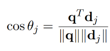

<font size="6">
Creating a search engine
</font>

<br>

First, we needed to install large amount of data to be able to search through it. 

I downloaded books as .txt files and only in english from Project Gutenberg using the following command in bash terminal:

```bash
    wget -w 2 -m -H "http://www.gutenberg.org/robot/harvest?filetypes[]=txt&langs[]=en"
    
```

Theese are the steps I followed to create a search engine:
<ol>
<li>Create dictionary with words in all books</li>
<li>For each document create vector "bag-of-words" which contains frequency of instances of given word in document</li>
<li>Create "term-by-document" matrix made of "bag-of-words" vectors</li>
<li>Inverse document frequency - reducing importance of words with high frequency</li>
</ol> 

All of above structures will be saved in json files to be able to use them later, using the following functions:

```python

def save_data(data,file_path):
    with open(file_path,'w') as file:
        json.dump(data,file)

def load_data(file_path):
    with open(file_path,'r') as file:
        data = json.load(file)
    return data

#for csr matrix we need to save it in a different way

def csr_matrix_to_dict(matrix):
    return {
        "data": matrix.data.tolist(),
        "indices": matrix.indices.tolist(),
        "indptr": matrix.indptr.tolist(),
        "shape": matrix.shape
    }

def save_csr(matrix,file_path):
    matrix_dict = csr_matrix_to_dict(matrix)
    with open(file_path,'w') as file:
        json.dump(matrix_dict,file)

def load_csr(file_path):
    with open(file_path, 'r') as file:
        matrix_dict = json.load(file)
    
    data = matrix_dict["data"]
    indices = matrix_dict["indices"]
    indptr = matrix_dict["indptr"]
    shape = tuple(matrix_dict["shape"])

    return csr_matrix((data, indices, indptr), shape=shape)


```

<br>

**Dictionary** is created by reading all the books and adding words to the dictionary if they are not already there:

```python
def create_keywords_set(folder_path):
    keywords_set = set()
    

    for filename in os.listdir(folder_path):
        file_path = os.path.join(folder_path, filename)

        if file_path.endswith('.txt'):
            
            with open(file_path, 'rb') as file:
                raw_data = file.read()
                encoding_result = chardet.detect(raw_data)
                encoding = encoding_result['encoding']
            
            try:
                with open(file_path, 'r', encoding=encoding) as file:
                    text = file.read()
                    words = re.findall(r'\b\w+\b', text.lower())

                    for word in words:
                        word = word.replace('_', '')
                        if word not in stop_words and word not in keywords_set:
                            keywords_set.add(word)

            except UnicodeDecodeError as e:
                print(f"UnicodeDecodeError: {e}. Skipping file: {file_path}")
                continue

    save_data(list(keywords_set),"keywords.json")
```

<br>

**Bag-of-words** is created by counting frequency of words in each document:

```python

def create_bag_of_words(file_path,keywords):
    word_vector = {keyword: 0 for keyword in keywords}

    with open(file_path, 'rb') as file:
        raw_data = file.read()
        encoding_result = chardet.detect(raw_data)
        encoding = encoding_result['encoding']


    try:
        with open(file_path,'r',encoding=encoding) as file:
            text = file.read()

            words = re.findall(r'\b\w+\b', text.lower())

            for word in words:
                word = word.replace('_', '')
                if word in keywords:
                    word_vector[word] += 1

    except UnicodeDecodeError as e:
        print(f"UnicodeDecodeError: {e}. Skipping file: {file_path}")

    return list(word_vector.values())

```

<br>

**Term-by-document matrix** is created by stacking all "bag-of-words" vectors:

```python

def create_term_by_document_matrix(folder_path,with_idf = True):
    keywords = load_data("keywords.json")
    all_vectors = []

    number_of_documents = 0
    document_frequency = {keyword: 0 for keyword in keywords}

    files = []

    for filename in os.listdir(folder_path):
        file_path = os.path.join(folder_path,filename)
        files.append(filename)
        d_i = create_bag_of_words(file_path,keywords)
        all_vectors.append(d_i)

        
        if number_of_documents%10 == 0:
            print(f"Current file: {file_path}, iteration: {number_of_documents}")

        number_of_documents += 1
        if with_idf:
            for i,value in enumerate(d_i):
                if value > 0:
                    keyword = keywords[i]
                    document_frequency[keyword] += 1

    if with_idf:            
        idf = {}

        for keyword,freq in document_frequency.items():
            idf[keyword] = np.log(number_of_documents/freq)

        for i in range(len(all_vectors)):
            for j in range(len(all_vectors[i])):
                if all_vectors[i][j] > 0:
                    all_vectors[i][j] *= idf[keywords[j]]

    save_data(files,"files.json")
    save_csr(csr_matrix(all_vectors),"csr_matrix.json")
    return all_vectors

```

<br>

**Inverse document frequency** is calculated by dividing number of documents by number of documents containing given word, I already implemented it in the function above.

<br>

**Search engine** works by calculating cosine similarity between query and each document and returning the most similar documents:

Similarity function:


q - query vector
d_j - j-th bag-of-words vector
q^T - transposed query vector

```python

def create_q_vector(input_text,keywords):
    q = {keyword: 0 for keyword in keywords}
    
    words = input_text.lower().split()
    for word in words:
        if word in keywords:
            q[word] += 1

    return list(q.values())

def similarity_function(A,q,k):

    q = np.array(q)

    cos_list = []

    for j in range(A.shape[0]):
        d_j = A.getrow(j).toarray()[0]

        result = 0
        for x in range(len(q)):
            if q[x] != 0 and d_j[x] !=0:
                result += q[x]*d_j[x]
        
        cos_list.append((result/(np.linalg.norm(q)*np.linalg.norm(d_j)),j))

    return sorted(cos_list,reverse=True)[:k]

```

<br>

Code for running the search engine:

```python

A = load_csr("csr_matrix.json")
keywords = load_data("keywords.json")
files = load_data("files.json")


input_text = input("Enter your search query: ")


q = create_q_vector(input_text,keywords)

coss = similarity_function(A,q,5)


for i in range(len(coss)):
    print("File name: " + str(files[coss[i][1]])+ ", similarity value: " +str(coss[i][0]))

```

<br>

In my code I've added option to not use IDF, let's compare the results with and without IDF:

```python
WITHOUT IDF:
create_term_by_document_matrix(folder_path,False)

WITH IDF:
create_term_by_document_matrix(folder_path)

```

My input text will be something related to bible, let's say: "__then jesus came and said to them I am the wine and bread__"

Let's run the search engine with and without IDF:

```python
Enter your search query: then jesus came and said to them I am the wine and bread
File name: 1242.txt, similarity value: 0.1992747968867369
File name: 1583.txt, similarity value: 0.18493728692381595
File name: 1660.txt, similarity value: 0.1664933263528233
File name: 1403.txt, similarity value: 0.16573709744971285
File name: 1419.txt, similarity value: 0.1614820694458524
```
As we can see, all of the top 5 results have similarity value close to each other, it maybe due the fact that theese books are related to bible, however, theese books are not, they are random.

<br>

So, let's try to run the search engine with IDF to check if the results will be different:

```python
Enter your search query: then jesus came and said to them I am the wine and bread
File name: 1670.txt, similarity value: 0.1227043098924063
File name: 1631.txt, similarity value: 0.03433222744872847
File name: 1477.txt, similarity value: 0.02721754824747554
File name: 1578.txt, similarity value: 0.02617647724507525
File name: 1433.txt, similarity value: 0.025867891497101135
```

As we can see, the similarity values differ from each other especially the first one, which is the most similar document to the query. Let's check the content of the first document:


**Title: The Small Catechism of Martin Luther**
Author: Martin Luther

We can see that the first document is related to bible, which is expected, however, the other documents are not related to bible, which is good, because it means that the search engine works correctly.


<br>


**Noise removal** is done by SVD decomposition on our term-by-matrix, which is implemented in the following function:
```python

def svd_on_matrix(k):
    A = load_csr("csr_matrix_test_idf.json")
    U,S,VT = svds(A,k)

    S = np.diag(S[:k])

    svd_matrix = np.dot(U,np.dot(S,VT))  
    save_csr(csr_matrix(svd_matrix),"csr_matrix_svd_test.json")

```
```python
Enter your search query: then jesus came and said to them I am the wine and bread
File name: 1670.txt, similarity value: 0.12252618844836205
File name: 1550.txt, similarity value: 0.04195102459943081
File name: 1463.txt, similarity value: 0.036957819663801884
File name: 1555.txt, similarity value: 0.03639725525897706
File name: 1631.txt, similarity value: 0.030945159449656794
```

As we can see, the results are similar to the results with IDF, however, the similarity values are slightly different, which is expected, because we reduced the noise in the matrix and we get slightly different files.

<br>

Lets try to run search engine on bigger dataset, I will use 2500 books from Project Gutenberg, I will use IDF, won't use SVD and will try to find the most similar documents to the query: "__then jesus came and said to them I am the wine and bread__"

```python
Enter your search query: then jesus came and said to them I am the wine and bread
File name: 17163.txt, similarity value: 0.21031170756930306
File name: 15185.txt, similarity value: 0.20488325464591034
File name: 14111.txt, similarity value: 0.1664016731028527
File name: 14572.txt, similarity value: 0.125654969092091
File name: 14497.txt, similarity value: 0.122535489022774
```
17163.txt - Stories from the New Testament
15185.txt - Quiet Talks on John's Gospel

**Conlusion:** 
<ul>
<li>The search engine works correctly, it returns the most similar documents to the query it is able to find the most similar documents to the query, even if the dataset is big.</li>
<li>To enable the search engine to work on bigger datasets, we can use SVD decomposition to reduce the noise in the matrix, which will make the search engine faster and more efficient.</li>
<li>It is not recommended to not use IDF, because it will make the search engine less efficient and the results will be less accurate.</li>
</ul>
  
   
